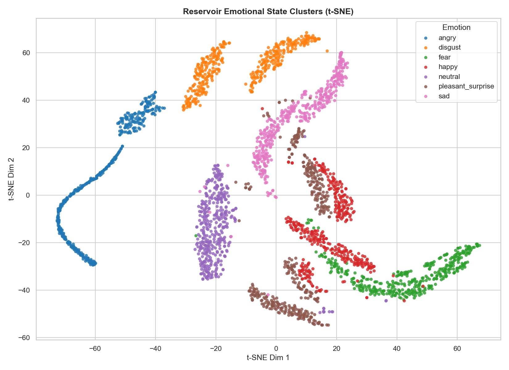
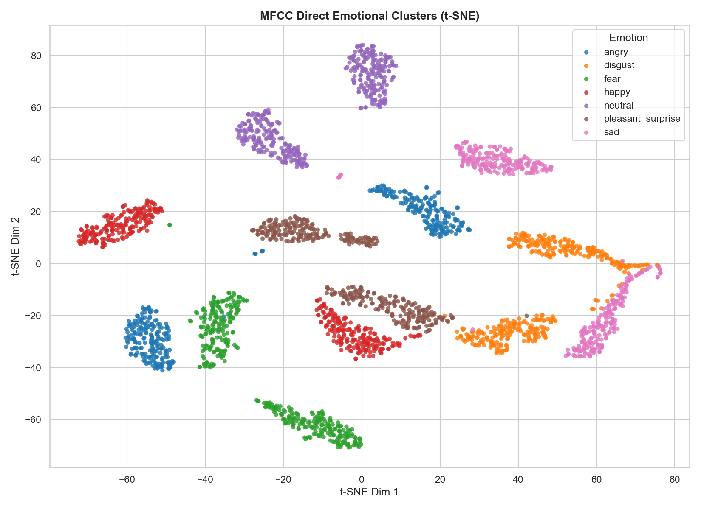
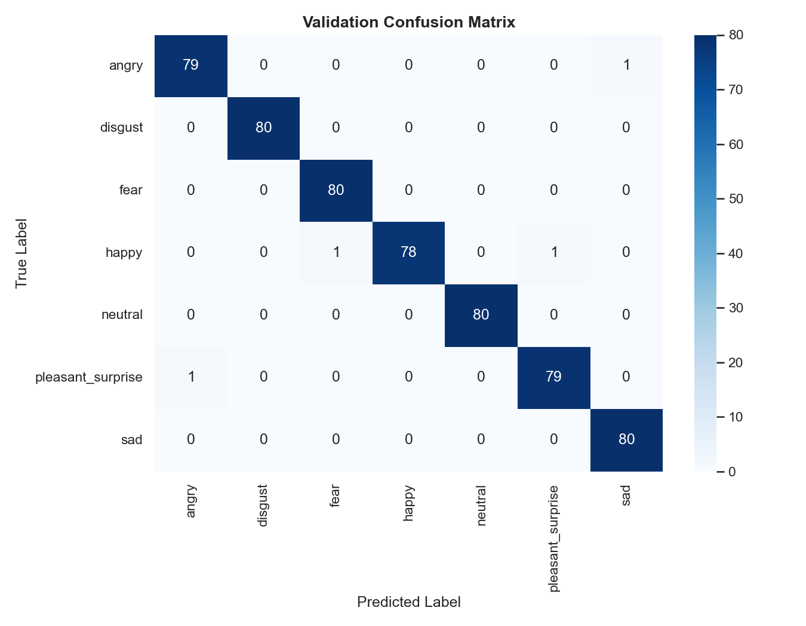
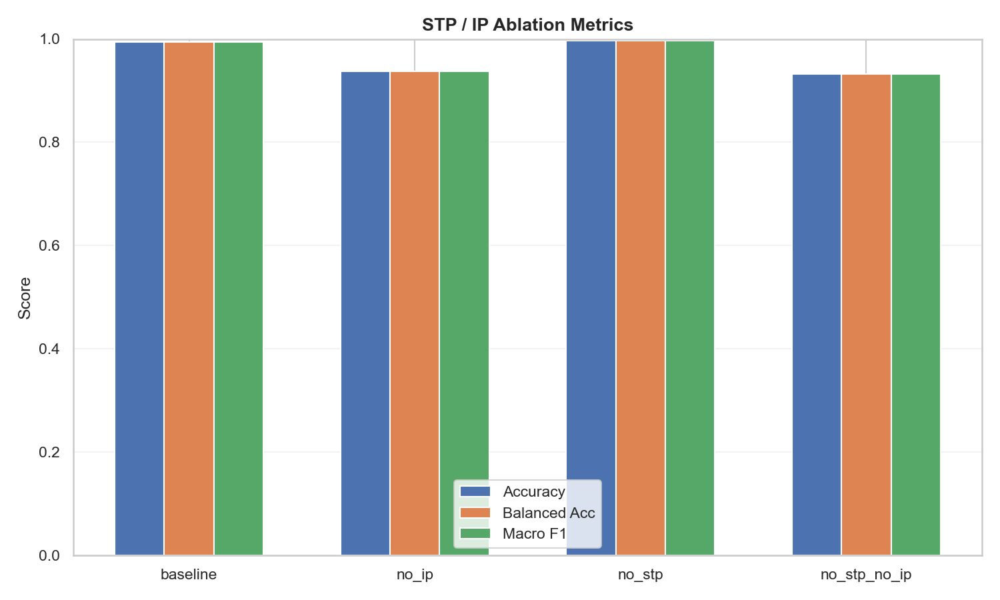
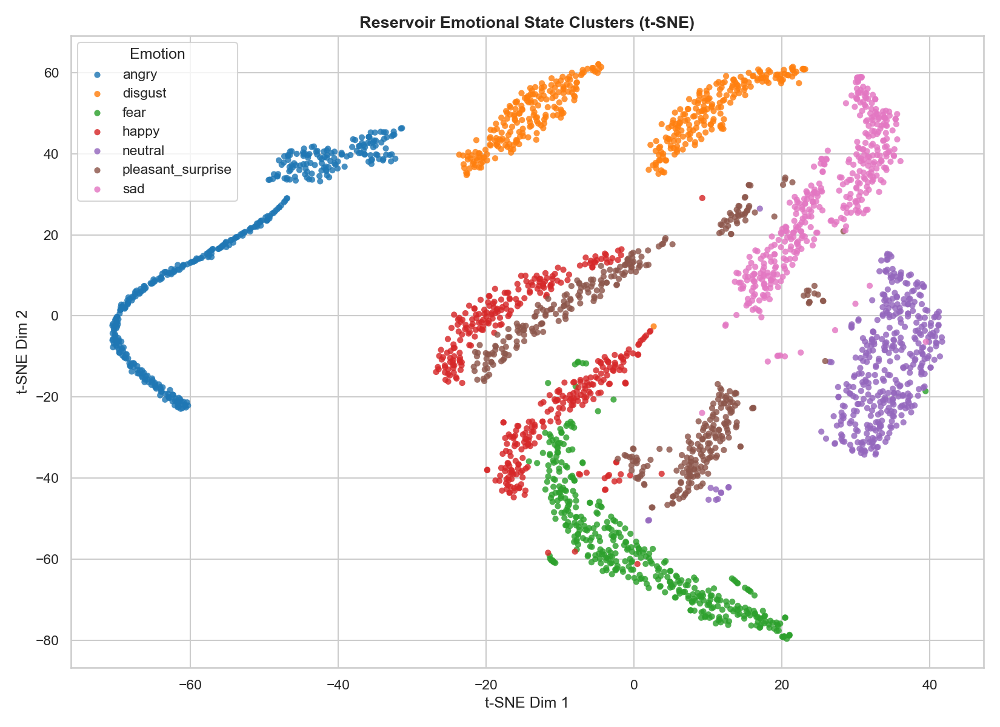
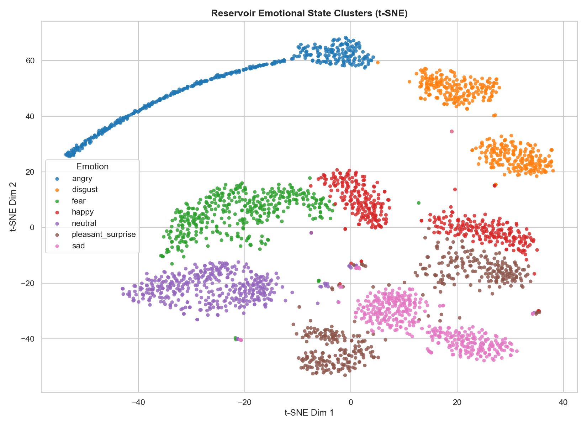
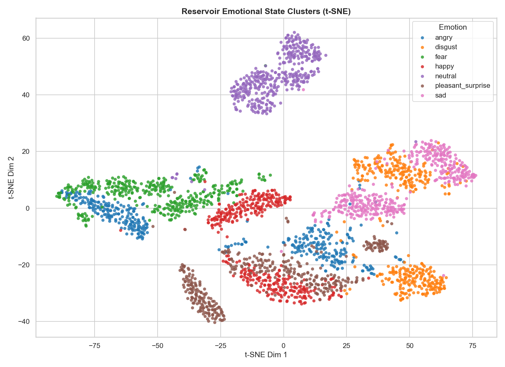
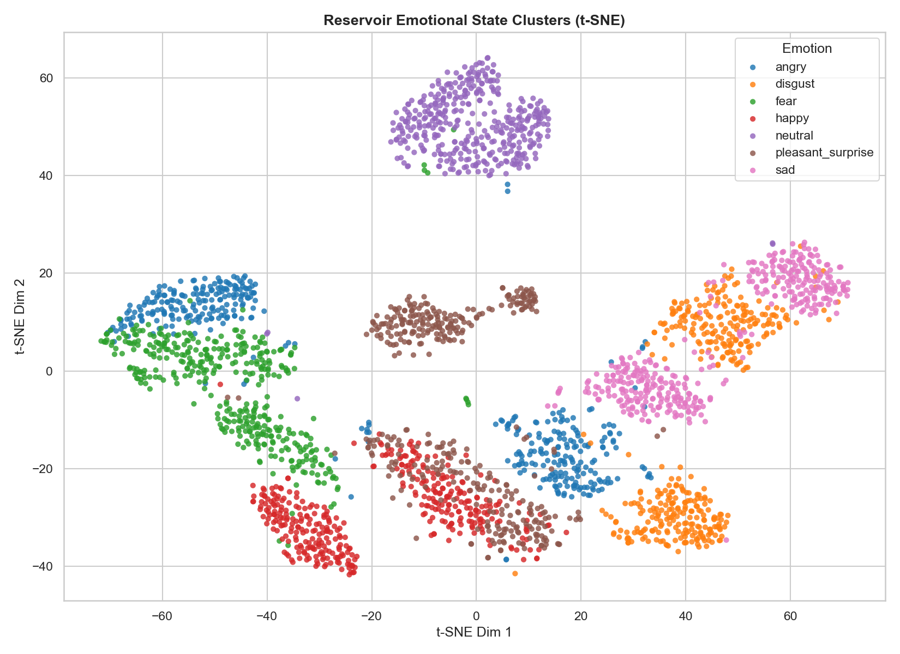

# Experiment Results Analysis

## Overview

当前分析主要基于以下结果：

- `results/classifier_metrics.yaml`
- `results/tsne_emotion_clusters.png`
- `experiments/stp_ip_ablation/outputs/comparison_report.md`
- `experiments/stp_ip_ablation/outputs/comparison_metrics.png`
- `experiments/stp_ip_ablation/outputs/readout_comparison/comparison_report.md`
- `experiments/mfcc_direct_classification/outputs/comparison_report.md`
- `experiments/mfcc_direct_classification/outputs/results/tsne_emotion_clusters.png`

---

## 1. Result Dashboard

### 1.1 Main Comparison Table

| Experiment | Feature Source | Classifier | Accuracy | Balanced Acc | Macro F1 | Key Takeaway |
| --- | --- | --- | ---: | ---: | ---: | --- |
| Reservoir baseline | Reservoir state (`800` dim) | Logistic Regression | `0.9946` | `0.9946` | `0.9946` | Reservoir 表征本身非常可分 |
| Direct MFCC | Flattened MFCC (`10320` dim) | Logistic Regression | `0.9929` | `0.9929` | `0.9928` | 与 reservoir baseline 几乎持平 |
| Direct MFCC | Flattened MFCC (`10320` dim) | Ridge Classifier | `0.9964` | `0.9964` | `0.9964` | 甚至略高于 reservoir baseline |
| Reservoir baseline | Reservoir state (`800` dim) | Nearest Centroid | `0.8411` | `0.8411` | `0.8388` | 低能力读出时 reservoir 仍有可分性 |
| Direct MFCC | Flattened MFCC (`10320` dim) | Nearest Centroid | `0.8696` | `0.8696` | `0.8694` | 直接 MFCC 在弱分类器下也不差 |
| Direct MFCC | Flattened MFCC (`10320` dim) | Gaussian NB | `0.3946` | `0.3946` | `0.3175` | Gaussian 假设不适合当前高维直接 MFCC |

### 1.2 Quick Takeaways

- 当前 `TESS + 整句分类 + 全量样本 + 线性读出` 设定下，直接 MFCC 已经是非常强的 baseline。
- `mfcc_direct + logistic_regression` 与 reservoir baseline 的差距只有约 `0.18` 个百分点。
- `mfcc_direct + ridge_classifier` 甚至略高于 reservoir baseline。
- `STP / IP` 消融里，`IP` 的影响明显大于 `STP`。
- 当前结果还不足以证明储备池在这个任务设定下具有明确优势。

---

## 2. Reservoir Baseline vs Direct MFCC

### 2.1 Quantitative Comparison

| Method | Classifier | Accuracy |
| --- | --- | ---: |
| Reservoir baseline | Logistic Regression | `0.9946` |
| Reservoir baseline | Ridge Classifier | `0.9911` |
| Reservoir baseline | Nearest Centroid | `0.8411` |
| Reservoir baseline | Gaussian NB | `0.7857` |
| Direct MFCC | Logistic Regression | `0.9929` |
| Direct MFCC | Ridge Classifier | `0.9964` |
| Direct MFCC | Nearest Centroid | `0.8696` |
| Direct MFCC | Gaussian NB | `0.3946` |

数据来源：

- `experiments/mfcc_direct_classification/outputs/comparison_report.md`
- `results/classifier_metrics.yaml`

### 2.2 t-SNE Visualization

| Reservoir Baseline t-SNE | Direct MFCC t-SNE |
| --- | --- |
|  |  |

图像观察：

- Reservoir baseline 的 `t-SNE` 聚类已经非常清晰。
- 直接 MFCC 的 `t-SNE` 同样分离得很好。
- 这说明当前数据集上，原始 MFCC 经简单展开后就已经具有很强的类别结构。

### 2.3 Confusion Matrix Comparison

| Reservoir Baseline + Logistic Regression | Direct MFCC + Logistic Regression |
| --- | --- |
|  |  |

这个对比很关键，因为它说明：

- 两者都已经接近“满分”混淆矩阵。
- 主要错误都非常少，而且集中在少数类别对之间。
- 因此，现在讨论的已经不是“能不能做对”，而是“储备池有没有带来额外收益”。

### 2.4 Interpretation

当前 direct MFCC 实验并不是一个弱 baseline。它做的是：

- 提取 `40` 维 MFCC
- 按最长帧数补齐到 `258` 帧
- 直接展平为约 `10320` 维特征

这意味着分类器拿到的是一个高信息量、整句级的时频表示。  
在这种设定下，逻辑回归和岭分类器非常强是合理现象，不是异常现象。

---

## 3. STP / IP Ablation

### 3.1 Ablation Metrics Table

| Condition | STP | IP | Accuracy | Balanced Acc | Macro F1 | Mean Rate |
| --- | --- | --- | ---: | ---: | ---: | ---: |
| `baseline` | on | on | `0.9946` | `0.9946` | `0.9946` | `0.0095` |
| `no_ip` | on | off | `0.9375` | `0.9375` | `0.9375` | `0.0017` |
| `no_stp` | off | on | `0.9964` | `0.9964` | `0.9964` | `0.0114` |
| `no_stp_no_ip` | off | off | `0.9321` | `0.9321` | `0.9324` | `0.0017` |

### 3.2 Ablation Plot

### 3.3 Visual Comparison Across Conditions

| Baseline (`STP + IP`) | No STP |
| --- | --- |
|  |  |

| No IP | No STP + No IP |
| --- | --- |
|  |  |

### 3.4 What This Experiment Really Shows

从这组结果中得到的结论是：

- `IP` 的影响明显强于 `STP`
- 去掉 `IP` 后性能明显下降
- 去掉 `STP` 后没有观察到稳定退化

因此，可以看出：

- “当前任务下哪种可塑性机制更关键”

---

## 4. Readout Comparison on Reservoir States

### 4.1 Reservoir Readout Table

| Condition | Logistic Regression | Ridge Classifier | Nearest Centroid | Gaussian NB |
| --- | ---: | ---: | ---: | ---: |
| `baseline` | `0.9946` | `0.9911` | `0.8411` | `0.7857` |
| `no_stp` | `0.9964` | `0.9857` | `0.9179` | `0.8768` |
| `no_ip` | `0.9375` | `0.9375` | `0.5321` | `0.4607` |
| `no_stp_no_ip` | `0.9321` | `0.9536` | `0.6482` | `0.6018` |

### 4.2 Readout Interpretation

这张表说明了两件事：

- 当前 reservoir states 本身已经非常可分，线性读出器几乎可以直接把信息吃干净。
- 一旦换成低能力读出器，性能差距会迅速拉开。

也就是说，当前研究焦点不是“有没有可分信息”，而是“这些信息来自 reservoir 的独特动态，还是来自任务本身已经太容易”。

---

## 5. Why Direct MFCC Is So Strong

当前任务是整句分类：

- 允许模型先看到整句全部信息
- 不要求在线、因果、流式决策
- 不要求在局部时间片上稳定判断

而储备池最可能体现优势的地方通常在：

- 时间记忆
- 在线因果处理
- 鲁棒性
- 小样本
- 分布偏移

因此，当前任务本身就不太能考出 reservoir 的“动态系统价值”。

---

## 6. Recommended Next Experiments

如果后续目标是继续认真研究 reservoir，建议把实验问题改成更能体现动态建模价值的版本。

### 6.1 Small-Sample Curve

目的：

- 比较 reservoir 与 direct MFCC 在小样本条件下的样本效率

建议：

- 每类只保留 `10 / 20 / 40 / 80 / 160 / 320` 条训练样本
- 固定验证集
- 画性能-样本数曲线

### 6.2 Speaker-Independent Evaluation

目的：

- 测试模型能否真正泛化到未见说话人

建议：

- 按 speaker 切分 train / validation
- 不允许同一 speaker 同时出现在训练和验证中

### 6.3 Noise / Reverberation Robustness

目的：

- 测试 reservoir 的时间整合是否能提升鲁棒性

建议：

- 在验证集逐步加入噪声、混响、通道扰动
- 比较性能退化曲线

### 6.4 Compressed Direct MFCC Baseline

目的：

- 做一个更公平的信息预算对比

建议：

- 不再直接使用 `10320` 维 flatten MFCC
- 改为比较：
  - MFCC 均值
  - MFCC 均值 + 标准差
  - delta / delta-delta 统计量
  - PCA 压缩后的 direct MFCC

### 6.5 Online / Streaming Recognition

目的：

- 真正测试 reservoir 的因果动态建模能力

建议：

- 只允许模型访问当前和过去帧
- 分时间片输出预测
- 比较早期预测性能与最终性能

---

## 7. Final Assessment

 在当前 TESS 整句分类设定下，direct MFCC 已经构成极强 baseline，储备池尚未体现明确优势；因此后续研究将转向更能体现动态建模价值的实验设定
